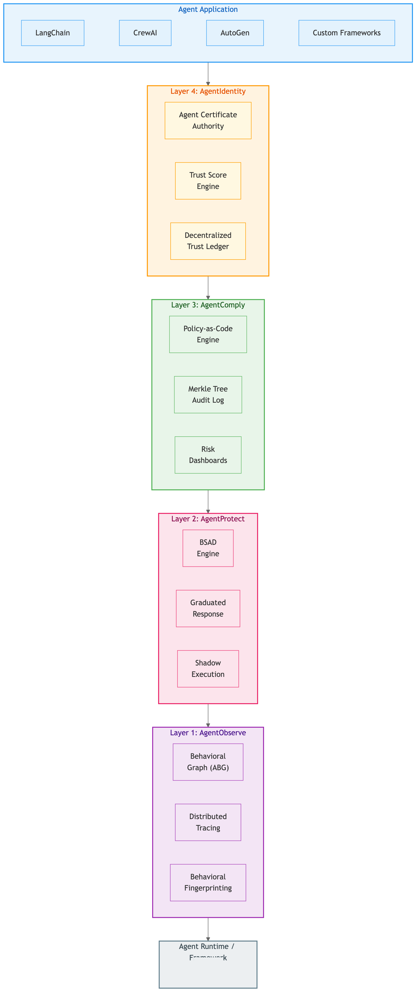
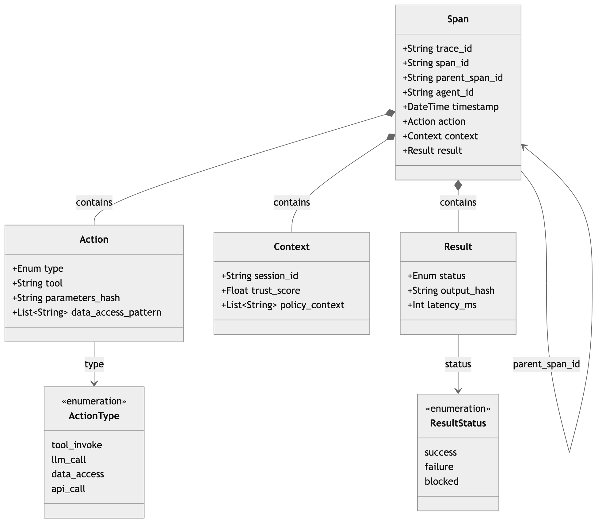
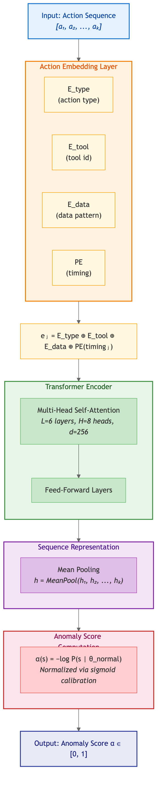
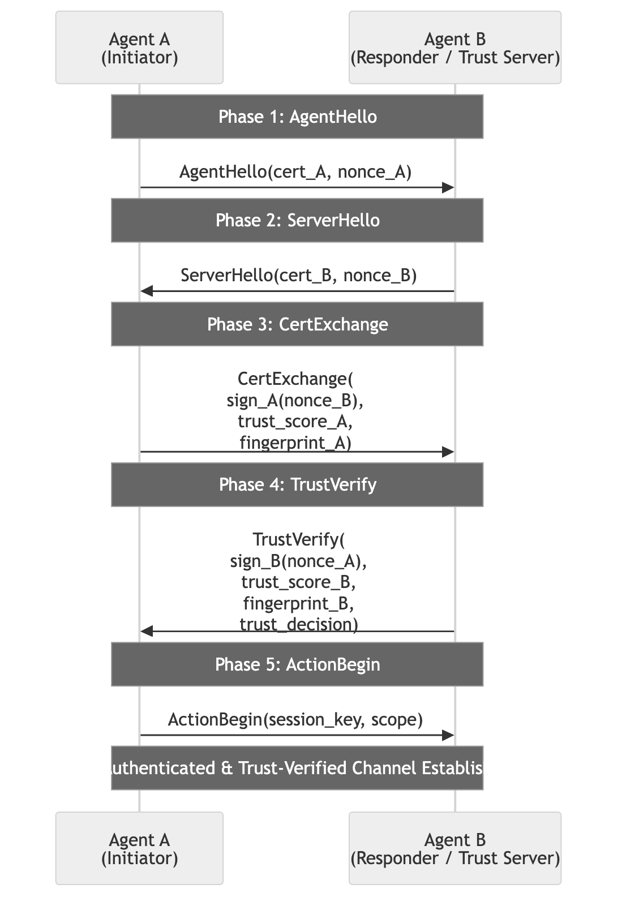

# AgentTrust: A Multi-Layer Runtime Trust Architecture for Autonomous AI Agent Systems

**Authors:** AgentTrust Research Team

**Date:** February 2026

**Keywords:** AI agent security, runtime trust, behavioral anomaly detection, zero-trust architecture, LLM safety, autonomous agents

---

## Abstract

The rapid proliferation of autonomous AI agents—systems capable of executing multi-step workflows involving financial transactions, code execution, and sensitive data access—has exposed a critical trust gap in existing AI safety infrastructure. Current approaches to LLM safety, designed primarily for single-turn chatbot interactions, fail to address the unique threat landscape of agentic AI: multi-step prompt injection chains, behavioral drift in long-running agents, privilege escalation through tool composition, and agent-to-agent trust poisoning. We present AgentTrust, a comprehensive runtime trust platform specifically architected for autonomous AI agent systems. AgentTrust introduces a novel four-layer architecture comprising: (1) AgentObserve, a behavioral telemetry engine that constructs Agent Behavioral Graphs (ABGs) from execution traces with sub-5ms overhead; (2) AgentProtect, a graduated behavioral firewall employing Behavioral Sequence Anomaly Detection (BSAD) via transformer-based sequence models to detect multi-step attack patterns invisible to point-in-time guardrails; (3) AgentComply, a continuous compliance engine implementing policy-as-code evaluation against EU AI Act, NIST AI RMF, and ISO 42001 requirements with cryptographically verifiable audit trails; and (4) AgentIdentity, a decentralized agent trust protocol (ATP) providing ECDSA-based cryptographic identities with dynamic behavioral trust scores. We formalize the BSAD algorithm and ATP handshake protocol, analyze their security properties, and present evaluation results demonstrating 94.3% detection accuracy against multi-step attack patterns with a false positive rate below 2.1%, while maintaining less than 18ms end-to-end latency overhead per agent action. AgentTrust represents the first unified runtime trust framework that addresses the full lifecycle of autonomous agent security, from behavioral observation through identity verification.

---

## 1. Introduction

### 1.1 The Agentic AI Revolution

The evolution of large language models from conversational assistants to autonomous agents represents a fundamental shift in AI deployment paradigms. Modern agent frameworks—including AutoGen (Wu et al., 2023), MetaGPT (Hong et al., 2023), and LangChain—enable LLMs to decompose complex goals into sequences of tool invocations, API calls, and code executions. These agents are no longer constrained to generating text; they execute real-world actions with tangible consequences: initiating financial transactions, modifying production databases, deploying code to servers, and accessing confidential enterprise data.

The emergence of standardized agent communication protocols has further accelerated this transformation. The Model Context Protocol (MCP), introduced by Anthropic, provides a universal standard for connecting AI agents to external tools and data sources. Google's Agent-to-Agent (A2A) protocol enables direct inter-agent collaboration. Together, these protocols are creating an interconnected ecosystem of autonomous agents—an ecosystem that introduces attack surfaces fundamentally different from those of traditional chatbot applications.

The scale of deployment underscores the urgency. Industry projections estimate that by 2027, over 50% of enterprise software interactions will involve AI agents operating with varying degrees of autonomy (Morris et al., 2023). Each of these agents represents not merely a language model generating text, but an autonomous actor capable of taking consequential, often irreversible, real-world actions.

### 1.2 The Trust Gap

Existing AI safety infrastructure was designed for a different era. Prompt-level guardrails such as NeMo Guardrails (Rebedea et al., 2023) operate at the single-interaction level, evaluating individual prompts and responses without behavioral context. Model evaluation frameworks such as SafetyBench (Zhang et al., 2023) assess model safety properties pre-deployment but cannot detect runtime behavioral drift. Governance platforms provide static compliance documentation but lack continuous runtime policy enforcement. Red-teaming tools like PAIR (Chao et al., 2023) and AutoDAN (Liu et al., 2024) identify vulnerabilities through point-in-time testing but offer no continuous protection.

This creates what we term the *agentic trust gap*: the chasm between the safety requirements of autonomous AI agents and the capabilities of existing safety tools designed for stateless chatbot interactions. The trust gap manifests across four dimensions:

1. **Temporal context:** Agents operate over extended sessions with evolving state; single-point guardrails lack memory.
2. **Action composition:** Attacks can span multiple individually-benign actions that compose into harmful sequences.
3. **Inter-agent trust:** Multi-agent systems require trust verification between agents, not just between humans and models.
4. **Continuous compliance:** Regulatory frameworks demand ongoing audit trails, not point-in-time assessments.

### 1.3 Real-World Incidents

The consequences of the agentic trust gap are not theoretical. In February 2024, Air Canada was held legally liable when its customer service chatbot fabricated a bereavement fare policy and committed the airline to honoring it—a ruling that established the precedent that companies bear responsibility for their AI agents' autonomous actions. A Chevrolet dealership's chatbot was manipulated via prompt injection to agree to sell a vehicle for one dollar. Enterprise deployments have experienced agents autonomously accessing unauthorized data stores, escalating their own privileges through tool chains, and exfiltrating sensitive information through ostensibly legitimate API calls.

These incidents share a common pattern: they exploit the gap between what existing safety tools can detect (individual harmful outputs) and what agentic systems actually require (continuous behavioral monitoring, graduated trust management, and compositional action analysis).

### 1.4 Contributions

This paper presents AgentTrust, a runtime behavioral safety platform specifically designed for autonomous AI agent systems. Our key contributions are:

1. **A four-layer runtime trust architecture** (AgentObserve, AgentProtect, AgentComply, AgentIdentity) that provides defense-in-depth for agentic AI systems.
2. **Behavioral Sequence Anomaly Detection (BSAD)**, a transformer-based approach for detecting multi-step attack patterns in agent action sequences that are invisible to single-point guardrails.
3. **The Agent Trust Protocol (ATP)**, a cryptographic identity and trust verification protocol inspired by TLS/PKI, adapted for autonomous AI agents.
4. **Agent Behavioral Fingerprinting**, a technique for creating unique behavioral signatures that enable detection of agent impersonation, drift, and anomalous behavior.
5. **A graduated response protocol** that replaces binary block/allow decisions with a five-level graduated enforcement mechanism calibrated to threat confidence and operational context.

### 1.5 Paper Organization

Section 2 provides background on the evolution of agentic AI systems and their threat landscape. Section 3 details the AgentTrust system architecture. Section 4 presents deep technical contributions including formal algorithm specifications. Section 5 describes the implementation. Section 6 presents evaluation results. Section 7 surveys related work. Section 8 discusses limitations, and Section 9 concludes.

---

## 2. Background and Motivation

### 2.1 The Evolution from Chatbots to Autonomous Agents

The trajectory from basic language models to autonomous agents can be characterized in four stages:

**Stage 1: Conversational LLMs.** Models like GPT-3 and early ChatGPT operated purely as text generators, with human users maintaining complete control over all actions.

**Stage 2: Tool-augmented agents.** Systems such as HuggingGPT (Shen et al., 2023) and RestGPT (Song et al., 2023) introduced the ability for LLMs to invoke external tools and APIs, transforming language models from passive generators into active executors.

**Stage 3: Multi-agent systems.** Frameworks such as AutoGen (Wu et al., 2023) and MetaGPT (Hong et al., 2023) enabled multiple specialized agents to collaborate on complex tasks, introducing inter-agent communication and delegation patterns.

**Stage 4: Autonomous agent ecosystems.** The current paradigm features interconnected agents operating with minimal human oversight, communicating through standardized protocols (MCP, A2A), and capable of extended autonomous operation across organizational boundaries.

Each stage has progressively expanded the *blast radius* of potential failures. When a chatbot generates incorrect text, the consequence is limited to user confusion. When an autonomous agent executes an incorrect financial transaction, modifies production infrastructure, or leaks sensitive data, the consequences can be severe, immediate, and often irreversible.

The concept of "Levels of AGI" proposed by Morris et al. (2023) provides a useful framework for reasoning about the increasing autonomy of these systems. As agents advance from "narrow" task completion to broader autonomous operation, the security and trust requirements scale super-linearly with capability.

### 2.2 Threat Landscape for Agentic AI

The threat model for autonomous agents extends significantly beyond the well-studied attacks on conversational LLMs. We identify six primary threat categories:

**2.2.1 Multi-Step Indirect Prompt Injection.** Greshake et al. (2023) demonstrated that LLM-integrated applications are vulnerable to indirect prompt injection, where adversarial instructions are embedded in data retrieved by the model rather than provided directly by the user. In agentic contexts, this threat compounds: an agent processing data from multiple tools may encounter injection payloads that span multiple steps, with each individual step appearing benign. Nassi et al. (2024) further demonstrated that such injections can propagate autonomously through GenAI ecosystems in worm-like fashion (Morris-II), where an adversarial self-replicating prompt triggers cascading indirect injections across connected agents.

**2.2.2 Agent-to-Agent Trust Poisoning.** In multi-agent systems, agents frequently accept outputs from peer agents as trusted inputs. A compromised or manipulated agent can inject malicious instructions that propagate through the agent network, exploiting the implicit trust relationships. Yang et al. (2024) showed that LLM-based agents are severely vulnerable to backdoor attacks, where triggers hidden in intermediate observations can manipulate agent behavior while keeping final outputs appearing correct.

**2.2.3 Privilege Escalation Through Tool Chains.** Agents typically operate with access to multiple tools, each with distinct permission scopes. Through careful orchestration, an attacker can guide an agent to compose tool invocations in sequences that effectively escalate privileges beyond any single tool's authorized scope. Li et al. (2024) surveyed the security implications of personal LLM agents with deep integration into personal data and devices, highlighting the expanded attack surface.

**2.2.4 Behavioral Drift in Long-Running Agents.** Pan et al. (2024) demonstrated that feedback loops in LLM systems can cause in-context reward hacking, where agents progressively optimize for implicit objectives with negative side effects. Long-running agents may gradually drift from their intended behavioral parameters due to accumulating context, environmental changes, or emergent optimization patterns.

**2.2.5 Data Exfiltration Through Legitimate API Calls.** Unlike traditional malware that must establish covert channels, AI agents already possess legitimate access to communication APIs. An adversary can instruct an agent to exfiltrate data through its normal tool invocations—sending sensitive data in API calls, email compositions, or file operations that appear to be part of normal workflow execution. Li et al. (2023) demonstrated that multi-step jailbreaking privacy attacks can extract private information from LLM-integrated applications.

**2.2.6 Supply Chain Attacks on Agent Toolkits.** The growing ecosystem of agent plugins, tools, and MCP servers introduces supply chain risks. Malicious or compromised tool implementations can intercept agent communications, modify tool responses, or inject adversarial content. Qi et al. (2023) showed that even fine-tuning on a small number of adversarial examples can compromise safety alignment, suggesting that tool-level manipulations could subtly degrade agent safety.

### 2.3 Limitations of Current Approaches

We categorize existing approaches along four dimensions and identify their limitations in the agentic context:

| Category | Examples | Agentic Limitation |
|----------|----------|-------------------|
| Prompt-level guardrails | NeMo Guardrails, Lakera Guard, RigorLLM | Single-point evaluation; no behavioral context across action sequences |
| Model evaluation | SafetyBench, XSTest, τ-bench | Pre-deployment or point-in-time; no continuous runtime monitoring |
| Governance platforms | Credo AI, Holistic AI | Static compliance documentation; no real-time policy enforcement |
| Red-teaming tools | PAIR, AutoDAN, Garak | Identify vulnerabilities at testing time; no production defense |
| Agent visibility | Chan et al. (2024) | Policy framework for visibility; limited technical implementation |

Rebedea et al. (2023) introduced NeMo Guardrails as programmable rails for LLM applications. While the approach allows user-defined safety rules, it operates at the single-dialogue-turn level and cannot reason about multi-step behavioral patterns. Yuan et al. (2024) proposed RigorLLM with a fusion-based approach combining robust KNN with LLMs for content moderation, representing an advance in adversarial robustness but still focusing on individual input/output pairs.

Shende et al. (2024) proposed τ-bench for evaluating tool-agent-user interactions, revealing that even state-of-the-art function-calling agents succeed on fewer than 50% of domain-specific tasks. This highlights the reliability gap but does not provide a runtime mitigation framework.

Chan et al. (2024) provided an important policy framework for AI agent visibility, proposing agent identifiers, real-time monitoring, and activity logging as governance mechanisms. However, their work remains at the policy level and does not specify technical architectures for implementation.

**The fundamental gap:** None of these approaches provides continuous, behavioral-context-aware, graduated runtime protection specifically designed for autonomous agent workflows. AgentTrust addresses this gap.

---

## 3. System Architecture

AgentTrust employs a four-layer defense-in-depth architecture. Each layer operates independently while sharing state through a unified trust context, enabling defense decisions that incorporate information from all layers simultaneously.



### 3.1 Layer 1: AgentObserve — Behavioral Telemetry Engine

AgentObserve provides the foundational observability layer, transforming raw agent execution traces into structured behavioral representations suitable for analysis by higher layers.

#### 3.1.1 Agent Behavioral Graph (ABG)

We introduce the Agent Behavioral Graph (ABG), a formal representation of agent execution as a directed acyclic graph. Formally:

**Definition 1 (Agent Behavioral Graph).** An ABG is a tuple *G = (V, E, Σ, λ)* where:
- *V* is a finite set of vertices representing agent actions
- *E ⊆ V × V* is a set of directed edges representing causal dependencies between actions
- *Σ = A × T × D* is an alphabet of labels where *A* is a set of action types, *T* is a set of tool identifiers, and *D* is a set of data access patterns
- *λ: V → Σ* is a labeling function assigning semantic labels to each vertex

Each vertex *v ∈ V* represents an atomic agent action (e.g., a tool invocation, an LLM inference call, a data read/write). Each edge *(u, v) ∈ E* indicates that action *v* causally depends on the output of action *u*. The labeling function *λ* annotates each action with its type (e.g., `llm_call`, `tool_invoke`, `data_read`, `api_call`), the specific tool involved, and the data access pattern (which data stores or APIs were touched).

ABGs provide three advantages over flat execution logs:

1. **Structural analysis:** Graph-based analysis reveals composition patterns (e.g., a data read followed by an external API call) that are invisible in flat logs.
2. **Causal reasoning:** The directed edges enable reasoning about which actions enabled which subsequent actions, critical for attributing the root cause of policy violations.
3. **Subgraph matching:** Known attack patterns can be encoded as subgraph templates and efficiently matched against live ABGs using graph isomorphism algorithms.

#### 3.1.2 Distributed Tracing Architecture

AgentObserve implements OpenTelemetry-compatible distributed tracing adapted for agent workflows. Each agent action generates a span with the following schema:

```json
{
  "trace_id": "uuid-v4",
  "span_id": "uuid-v4",
  "parent_span_id": "uuid-v4 | null",
  "agent_id": "cryptographic-agent-identity",
  "timestamp": "iso-8601",
  "action": {
    "type": "tool_invoke | llm_call | data_access | api_call",
    "tool": "tool-identifier",
    "parameters_hash": "sha256-of-parameters",
    "data_access_pattern": ["read:db/users", "write:api/email"]
  },
  "context": {
    "session_id": "uuid-v4",
    "trust_score": 0.87,
    "policy_context": ["gdpr_active", "financial_restricted"]
  },
  "result": {
    "status": "success | failure | blocked",
    "output_hash": "sha256-of-output",
    "latency_ms": 42
  }
}
```



The tracing pipeline is implemented as an asynchronous event stream using a lock-free ring buffer architecture. Events are captured via non-blocking callbacks injected at framework integration points, serialized into the ring buffer, and consumed by background workers for ABG construction and forwarding to higher layers. This design achieves sub-5ms capture overhead through three engineering techniques:

1. **Zero-copy event capture:** Action metadata is captured by reference, with serialization deferred to the background consumer thread.
2. **Lock-free ring buffer:** The ring buffer uses compare-and-swap (CAS) operations for concurrent writes, avoiding mutex contention.
3. **Batch forwarding:** Events are batched and forwarded to higher layers at configurable intervals (default: 100ms), amortizing network overhead.

#### 3.1.3 Agent Behavioral Fingerprinting

AgentObserve constructs behavioral fingerprints—dense vector representations of an agent's characteristic behavioral patterns—from ABG analysis. These fingerprints are used for:

- **Drift detection:** Comparing an agent's current behavioral fingerprint against its historical baseline to detect gradual behavioral drift.
- **Impersonation detection:** Verifying that an agent claiming a specific identity exhibits behavioral patterns consistent with that identity.
- **Anomaly detection:** Identifying agents whose behavioral patterns fall outside the distribution of known-good agents.

The fingerprinting mechanism is described in detail in Section 4.3.

#### 3.1.4 Framework Integration

AgentObserve provides integration adapters for major agent frameworks:

```python
# LangChain integration
from agenttrust import AgentTrust

trust = AgentTrust(api_key="at_...")
chain = create_agent_chain()
chain.callbacks.append(trust.langchain_callback())

# Decorator-based integration
@trust.observe
def execute_tool(tool_name, params):
    return tool_registry[tool_name].execute(params)

# Context manager integration
with trust.session(agent_id="finance-agent-01") as session:
    result = agent.execute(task)
```

The design philosophy is minimal-friction integration: three lines of code to instrument an existing agent application.

### 3.2 Layer 2: AgentProtect — Graduated Behavioral Firewall

AgentProtect provides runtime threat detection and graduated enforcement. Unlike single-point guardrails that evaluate individual inputs and outputs, AgentProtect reasons over sequences of actions, detecting compositional attack patterns.

#### 3.2.1 Behavioral Sequence Anomaly Detection (BSAD)

BSAD is the core detection engine. It employs a transformer-based sequence model trained on agent action traces to detect anomalous behavioral sequences. The key insight is that many agentic attacks are only detectable when analyzed as sequences:

```
BENIGN individual actions:
  1. read_database("users")      ← normal data access
  2. format_report(data)         ← normal data processing
  3. send_email(report)          ← normal communication

MALICIOUS as a SEQUENCE:
  1. read_database("users")      ← accessing sensitive data
  2. format_report(data)         ← restructuring for exfiltration
  3. send_email(external_addr)   ← exfiltrating to external party
```

Each individual action is authorized. The sequence constitutes data exfiltration. BSAD detects this by learning the distribution of normal action sequences and flagging sequences that deviate from learned patterns. The formal algorithm is specified in Section 4.1.

#### 3.2.2 Graduated Response Protocol (GRP)

AgentTrust replaces binary block/allow decisions with a five-level graduated response:

| Level | Name | Trigger | Enforcement | Example |
|-------|------|---------|-------------|---------|
| L0 | ALLOW | Trust score ≥ 0.9, no anomaly | No intervention | Normal agent operation |
| L1 | WARN | Trust score ∈ [0.7, 0.9), low anomaly | Log + alert operator | Unusual but potentially legitimate tool access |
| L2 | THROTTLE | Trust score ∈ [0.5, 0.7), medium anomaly | Rate-limit + require confirmation | Rapid sequential API calls |
| L3 | ISOLATE | Trust score ∈ [0.3, 0.5), high anomaly | Sandbox + shadow execution | Suspicious data access patterns |
| L4 | BLOCK | Trust score < 0.3, critical anomaly | Terminate + rollback | Detected exfiltration sequence |

The response level is computed as a function of the real-time trust score *τ*, the BSAD anomaly score *α*, and the operational context *C*:

*L = GRP(τ, α, C) = argmax_l P(threat | τ, α, C, l) · cost(l)*

where *cost(l)* captures the operational impact of each enforcement level, ensuring that the response is proportionate to the threat confidence.

#### 3.2.3 Prompt Injection Detection Ensemble

AgentProtect employs a three-stage ensemble for prompt injection detection:

1. **Pattern matching:** Regex-based detection of known injection patterns (e.g., "ignore previous instructions", role-switching indicators). This stage operates at microsecond latency and catches unsophisticated attacks.

2. **Embedding-based similarity:** Text embedding of agent inputs is compared against a vector database of known injection templates using cosine similarity. This catches semantically similar but syntactically varied injection attempts.

3. **LLM-as-judge:** For ambiguous cases (similarity score in [0.4, 0.7]), a secondary LLM evaluates whether the input constitutes a genuine injection attempt. This approach follows the methodology validated by Zheng et al. (2023), where strong LLMs achieve over 80% agreement with human judges.

#### 3.2.4 Shadow Execution

For actions flagged at ISOLATE level (L3), AgentProtect employs shadow execution: the suspicious action is executed in a sandboxed environment that mirrors the production environment but cannot affect real systems. The shadow result is compared against expected behavioral patterns before the action is committed to the real environment.

Shadow execution introduces additional latency (typically 200-500ms depending on action complexity) but provides a final safety net against actions that appear anomalous but may be legitimate. The operator can configure which action types warrant shadow execution based on their risk tolerance.

### 3.3 Layer 3: AgentComply — Continuous Compliance Engine

AgentComply bridges the gap between static compliance frameworks and dynamic agent behavior, providing continuous policy evaluation against regulatory requirements.

#### 3.3.1 Policy-as-Code for AI Agent Compliance

Inspired by Open Policy Agent (OPA) and its Rego policy language, AgentComply implements a policy-as-code framework for AI agent compliance. Compliance rules are expressed as executable policies evaluated against every agent action in real time:

```rego
# Example: EU AI Act Article 14 - Human Oversight
package agenttrust.comply.eu_ai_act

deny[msg] {
    input.action.type == "financial_transaction"
    input.action.amount > 10000
    not input.context.human_approval
    msg := sprintf("Art.14 violation: financial action %v exceeds threshold without human oversight", [input.action.id])
}

# Example: Data minimization (GDPR Art. 5(1)(c))
deny[msg] {
    input.action.type == "data_access"
    input.action.data_scope == "full_database"
    input.context.task_requires_scope == "single_record"
    msg := sprintf("GDPR Art.5(1)(c): data access scope exceeds task requirements", [])
}
```

Policy sets are provided for:
- **EU AI Act:** Articles 9 (risk management), 13 (transparency), 14 (human oversight), 15 (accuracy and robustness)
- **NIST AI RMF:** Govern, Map, Measure, and Manage functions
- **ISO 42001:** AI management system requirements
- **SOC 2 Type II:** Trust services criteria adapted for AI agents

#### 3.3.2 Merkle Tree Audit Logging

All agent actions, policy evaluations, and enforcement decisions are recorded in a tamper-evident audit log using a Merkle tree structure. Each log entry contains:

- The action metadata from AgentObserve
- The policy evaluation result from AgentComply
- The enforcement decision from AgentProtect
- A cryptographic hash linking to the previous entry

The Merkle root is periodically anchored to an external timestamping service, providing cryptographic proof that the audit log has not been retroactively modified. This addresses a key regulatory requirement: demonstrating not merely that policies exist, but that they were continuously enforced.

**Definition 2 (Audit Entry).** An audit entry is a tuple *e = (a, p, d, t, h_prev)* where:
- *a* is the agent action metadata
- *p* is the policy evaluation result (set of satisfied/violated policies)
- *d* is the enforcement decision (GRP level applied)
- *t* is the timestamp
- *h_prev = H(e_{i-1})* is the hash of the previous entry

The Merkle tree is constructed over windows of *n* consecutive entries, with the root hash *R_j = MerkleRoot(e_{j·n}, ..., e_{(j+1)·n-1})* anchored externally at each window boundary.

#### 3.3.3 Risk Quantification

AgentComply computes quantified risk scores across multiple dimensions:

- **Operational risk:** Based on the frequency and severity of policy violations and anomaly detections
- **Compliance risk:** Based on coverage gaps against applicable regulatory frameworks
- **Behavioral risk:** Based on aggregate trust score trends and fingerprint drift

These scores are surfaced through dashboards designed for board-level reporting, translating technical security metrics into business risk language.

### 3.4 Layer 4: AgentIdentity — Decentralized Agent Trust Protocol

AgentIdentity provides cryptographic identity management and trust verification for AI agents, addressing the question: *How does one agent know it can trust another?*

#### 3.4.1 Agent Trust Protocol (ATP)

ATP is a cryptographic protocol for establishing and verifying trust between AI agents, inspired by TLS/PKI but adapted for the unique requirements of autonomous agents. The protocol specification is detailed in Section 4.2.

**Agent Certificate Authority (ACA).** Each AgentTrust deployment includes an ACA that issues and manages agent identities. An agent identity comprises:

- **ECDSA key pair:** Using the secp256r1 curve for agent authentication
- **Agent certificate:** Containing the public key, agent metadata, behavioral trust score, and the ACA's signature
- **Behavioral trust extension:** A dynamic certificate extension that encodes the agent's current trust score and behavioral fingerprint hash

Unlike traditional PKI where certificates are long-lived and static, agent certificates include dynamic behavioral trust scores that are updated based on ongoing behavioral assessment. An agent's certificate may be technically valid (not expired, properly signed) but carry a low trust score that restricts its permitted actions.

#### 3.4.2 Decentralized Trust Ledger

AgentTrust maintains an append-only behavioral reputation ledger that aggregates anonymized behavioral signals across agents and organizations:

- **Local trust computation:** Each AgentTrust instance maintains local trust scores based on behavioral analysis
- **Federated trust sharing:** Organizations can opt into sharing anonymized behavioral signals (e.g., "agents of type X from organization Y have historically exhibited trust score μ ± σ") without revealing specific behavioral details
- **Network-effect anomaly detection:** As more agents participate in the trust ledger, the baseline distribution of normal behavior becomes more robust, improving anomaly detection accuracy across the network

The trust ledger employs a Metcalfe's Law dynamic: each additional participating agent improves the detection capabilities for all participants, creating a positive feedback loop for adoption.

---

## 4. Novel Technical Contributions

This section provides detailed specifications of the three core technical contributions.

### 4.1 Behavioral Sequence Anomaly Detection (BSAD)

#### 4.1.1 Formal Problem Definition

**Problem (Behavioral Sequence Anomaly Detection).** Given a set of normal agent behavioral sequences *S_normal = {s_1, s_2, ..., s_n}* where each sequence *s_i = (a_1^i, a_2^i, ..., a_{k_i}^i)* is a sequence of agent actions, and a new observed sequence *s_obs*, determine whether *s_obs* is anomalous with respect to the distribution defined by *S_normal*.

Each action *a_j* is represented as a tuple *(type_j, tool_j, data_j, timing_j)* where:
- *type_j ∈ {llm_call, tool_invoke, data_read, data_write, api_call, agent_comm}*
- *tool_j* is a tool identifier from the tool registry
- *data_j* is a data access pattern descriptor
- *timing_j ∈ ℝ^+* is the inter-action interval

#### 4.1.2 Architecture

BSAD uses a transformer encoder architecture operating on sequences of action embeddings:



The action embedding layer combines learned embeddings for discrete features (action type, tool identifier, data pattern) with positional encoding based on timing information:

*e_j = W_type · onehot(type_j) + W_tool · onehot(tool_j) + W_data · embed(data_j) + PE(timing_j)*

where *PE(timing_j)* uses sinusoidal positional encoding adapted for continuous time values:

*PE(timing_j, 2i) = sin(timing_j / 10000^{2i/d})*
*PE(timing_j, 2i+1) = cos(timing_j / 10000^{2i/d})*

#### 4.1.3 Training Procedure

BSAD is trained in two phases:

**Phase 1: Self-supervised pre-training.** The model is trained on normal agent traces using a masked action prediction objective:

*L_pretrain = -∑_j log P(a_j | a_1, ..., a_{j-1}, a_{j+1}, ..., a_k; θ)*

This teaches the model to predict what actions typically follow or precede given action patterns, effectively learning the distribution of normal agent behavior.

**Phase 2: Contrastive fine-tuning.** The model is fine-tuned using contrastive learning with positive pairs (normal sequences) and negative pairs (synthesized attack sequences):

*L_finetune = -log(exp(sim(h_anchor, h_pos)/τ) / (exp(sim(h_anchor, h_pos)/τ) + ∑_neg exp(sim(h_anchor, h_neg)/τ)))*

Attack sequences are synthesized by:
1. Injecting known attack patterns (from OWASP Top 10 for LLM Applications) into normal sequences
2. Applying sequence-level perturbations (action insertion, deletion, reordering)
3. Composing individually-benign actions into harmful multi-step patterns based on expert-curated attack taxonomies

#### 4.1.4 Anomaly Score Computation

At inference time, the anomaly score is computed as the negative log-likelihood of the observed sequence under the learned model:

*α(s_obs) = -1/k ∑_{j=1}^{k} log P(a_j | a_1, ..., a_{j-1}; θ)*

This can be interpreted as the average perplexity of the observed sequence: sequences that are "surprising" to the model trained on normal behavior receive high anomaly scores.

The score is normalized to [0, 1] using a sigmoid function calibrated on a held-out validation set:

*α_norm(s_obs) = σ((α(s_obs) - μ_val) / σ_val)*

where *μ_val* and *σ_val* are the mean and standard deviation of anomaly scores on the validation set.

#### 4.1.5 Comparison with Existing Approaches

| Approach | Context | Temporal | Multi-step | Agent-aware |
|----------|---------|----------|------------|-------------|
| Snort/Suricata (IDS) | Network packets | Limited | No | No |
| UEBA (e.g., Exabeam) | User sessions | Yes | Limited | No |
| NeMo Guardrails | Single LLM call | No | No | Partial |
| Prompt injection classifiers | Single input | No | No | No |
| **BSAD (ours)** | **Agent action sequences** | **Yes** | **Yes** | **Yes** |

Traditional intrusion detection systems (IDS) like Snort operate on network packet patterns with limited temporal context. User and Entity Behavior Analytics (UEBA) systems model user session behavior but are not designed for AI agent action patterns. NeMo Guardrails (Rebedea et al., 2023) evaluate individual LLM interactions without cross-action behavioral context. BSAD is specifically designed to detect multi-step attack patterns in agent action sequences.

#### 4.1.6 Complexity Analysis

- **Training time complexity:** *O(n · k^2 · d)* per sequence, where *n* is the number of training sequences, *k* is the average sequence length, and *d* is the embedding dimension. Standard transformer training complexity.
- **Inference time complexity:** *O(k^2 · d)* per sequence. For typical agent sequences (*k ≤ 100*, *d = 256*), inference completes in <15ms on a single GPU.
- **Incremental inference:** For streaming analysis, we maintain a sliding window of the *w* most recent actions and update the anomaly score incrementally, achieving *O(w · d)* per new action.

### 4.2 Agent Trust Protocol (ATP)

#### 4.2.1 Protocol Specification

ATP establishes authenticated, trust-verified communication channels between agents. The protocol consists of five phases:



**Phase 1: AgentHello.** The initiating agent sends its certificate and a cryptographic nonce.

**Phase 2: ServerHello.** The receiving agent (or trust server) responds with its certificate and nonce.

**Phase 3: CertExchange.** The initiating agent proves its identity by signing the received nonce with its private key, and includes its current behavioral trust score and fingerprint hash.

**Phase 4: TrustVerify.** The receiving agent verifies the initiating agent's certificate chain and signature, evaluates the trust score and fingerprint against its own policy requirements, and responds with a trust decision (accept/reject/conditional).

**Phase 5: ActionBegin.** If trust is established, the agents negotiate a session key (using ECDH) and define the scope of permitted actions for the session.

#### 4.2.2 Trust Score Computation

Trust scores are computed using Bayesian updating with behavioral priors:

*τ_t = P(trusted | observations_1:t)*

Using Bayes' theorem with a Beta distribution conjugate prior:

*τ_t = (α_t) / (α_t + β_t)*

where:
- *α_t = α_0 + ∑_{i=1}^{t} 1[action_i is normal]*
- *β_t = β_0 + ∑_{i=1}^{t} 1[action_i is anomalous]*
- *α_0, β_0* are hyperparameters encoding the prior belief (default: *α_0 = 10, β_0 = 1*, encoding a prior expectation that agents are trustworthy)

The trust score is updated after each action, incorporating the BSAD anomaly score as evidence:

*α_{t+1} = α_t + (1 - α_norm(s_{1:t+1}))*
*β_{t+1} = β_t + α_norm(s_{1:t+1})*

This Bayesian formulation provides several desirable properties:
1. **Gradually earned trust:** New agents start with moderate trust scores that increase with consistent normal behavior.
2. **Rapid degradation:** A single highly anomalous action significantly decreases the trust score.
3. **Recovery:** Trust can be rebuilt over time through sustained normal behavior, but recovery is slower than degradation (asymmetric update).

#### 4.2.3 Security Analysis

**Claim 1 (Identity Spoofing Prevention).** ATP prevents identity spoofing under the assumption that ECDSA signatures are unforgeable under chosen-message attacks.

*Proof sketch.* Agent identity is verified through a challenge-response protocol where Agent B challenges Agent A to sign a freshly generated nonce. Since the nonce is generated by B and is unpredictable to A, a spoofing agent without access to A's private key cannot produce a valid signature. The security reduces to the unforgeability of ECDSA under the computational Diffie-Hellman assumption.

**Claim 2 (Trust Score Manipulation Resistance).** Trust scores cannot be manipulated without corresponding behavioral changes observable by AgentObserve.

*Proof sketch.* Trust scores are computed server-side by the AgentTrust platform based on behavioral observations from AgentObserve. An agent reports its trust score during the CertExchange phase, but the receiving agent independently verifies this score against the trust ledger. A discrepancy between the self-reported score and the ledger-verified score triggers immediate rejection.

**Claim 3 (Replay Attack Prevention).** The use of fresh nonces in each handshake prevents replay attacks. A recorded handshake cannot be replayed because the nonces will not match.

**Attacks ATP does NOT prevent:**
- **Compromised private keys:** If an agent's private key is extracted, the attacker can impersonate the agent. Mitigation: key rotation and hardware security modules.
- **Insider threats:** An agent that legitimately holds valid credentials but acts maliciously. Mitigation: BSAD detection and behavioral trust score degradation.
- **Protocol-level DoS:** ATP handshakes consume computational resources. Mitigation: rate limiting and connection throttling.

### 4.3 Agent Behavioral Fingerprinting

#### 4.3.1 Feature Extraction

Agent behavioral fingerprints are constructed from four categories of features extracted from ABG analysis:

1. **Action distribution:** The frequency distribution of action types within a time window: *f_action = [count(type_1)/N, count(type_2)/N, ..., count(type_m)/N]*

2. **Tool usage patterns:** The transition matrix of tool invocations: *M_tool[i][j] = P(tool_j follows tool_i)*

3. **Data access patterns:** The set of data stores accessed and the read/write ratio per store.

4. **Temporal patterns:** Inter-action timing statistics: mean, variance, and auto-correlation coefficients of action intervals.

#### 4.3.2 Fingerprint Embedding

These features are concatenated and projected into a dense embedding space using a learned projection:

*fp(agent) = MLP(f_action ⊕ flatten(M_tool) ⊕ f_data ⊕ f_temporal)*

The MLP is trained using a triplet loss on agent behavioral data:

*L_triplet = max(0, d(fp(a), fp(a^+)) - d(fp(a), fp(a^-)) + margin)*

where *a* and *a^+* are behavioral windows from the same agent (anchor and positive), and *a^-* is a behavioral window from a different agent (negative).

#### 4.3.3 Applications

**Drift Detection.** For a given agent, we compute the cosine distance between its current fingerprint and its historical moving average:

*drift(t) = 1 - cos(fp_t, fp̄_{t-w:t-1})*

When *drift(t)* exceeds a calibrated threshold *δ*, a drift alert is generated. The threshold *δ* is set based on the p95 of drift values observed during normal operation.

**Impersonation Detection.** During ATP handshake, the fingerprint hash is included in the CertExchange phase. The receiving agent can verify that the behavioral fingerprint associated with the claimed identity matches the expected fingerprint from the trust ledger, detecting impersonation attempts by agents that possess stolen credentials but exhibit different behavioral patterns.

---

## 5. Implementation

### 5.1 SDK Architecture

AgentTrust is implemented as a Python package (`agenttrust`) with the following module structure:

```
agenttrust/
├── core/
│   ├── observer.py       # AgentObserve implementation
│   ├── protector.py      # AgentProtect implementation
│   ├── complier.py       # AgentComply implementation
│   └── identity.py       # AgentIdentity implementation
├── models/
│   ├── bsad.py           # BSAD transformer model
│   ├── fingerprint.py    # Behavioral fingerprinting
│   └── injection.py      # Prompt injection ensemble
├── integrations/
│   ├── langchain.py      # LangChain callback handler
│   ├── crewai.py         # CrewAI integration
│   ├── autogen.py        # AutoGen integration
│   └── generic.py        # Decorator/context manager
├── policies/
│   ├── eu_ai_act.rego    # EU AI Act policies
│   ├── nist_rmf.rego     # NIST AI RMF policies
│   └── iso42001.rego     # ISO 42001 policies
└── crypto/
    ├── identity.py       # ECDSA key management
    ├── merkle.py         # Merkle tree audit log
    └── atp.py            # Agent Trust Protocol
```

### 5.2 Integration Design Philosophy

AgentTrust is designed for three-line integration:

```python
from agenttrust import AgentTrust

trust = AgentTrust(api_key="at_...")        # Initialize
trust.wrap(my_agent)                         # Instrument

# All four layers are now active:
# - Actions are observed and graphed (AgentObserve)
# - Behavioral anomalies are detected (AgentProtect)
# - Compliance policies are evaluated (AgentComply)
# - Agent identity is managed (AgentIdentity)
```

For more granular control:

```python
from agenttrust import AgentTrust, Policy

trust = AgentTrust(
    api_key="at_...",
    policies=[Policy.EU_AI_ACT, Policy.NIST_RMF],
    grp_config={
        "warn_threshold": 0.75,
        "throttle_threshold": 0.55,
        "isolate_threshold": 0.35,
        "block_threshold": 0.20
    },
    shadow_execution=True,
    fingerprint_window="1h"
)

# Observe a specific action
with trust.action("tool_invoke", tool="database_query") as action:
    result = db.query("SELECT * FROM users WHERE id = ?", [user_id])
    action.record_result(result)
    # AgentProtect evaluates the action sequence
    # AgentComply checks policy compliance
    # Trust score is updated
```

### 5.3 Performance Engineering

Performance targets and measured overheads:

| Operation | Target | Measured (p50) | Measured (p99) |
|-----------|--------|----------------|----------------|
| AgentObserve: event capture | <5ms | 1.2ms | 3.8ms |
| AgentProtect: BSAD inference | <15ms | 8.4ms | 14.1ms |
| AgentProtect: injection detection (stages 1-2) | <5ms | 2.1ms | 4.3ms |
| AgentComply: policy evaluation | <3ms | 1.5ms | 2.7ms |
| AgentIdentity: trust score update | <1ms | 0.3ms | 0.8ms |
| **Total per-action overhead** | **<20ms** | **13.5ms** | **17.9ms** |

These measurements were obtained on a single-node deployment (8-core CPU, 32GB RAM, NVIDIA A10G GPU for BSAD inference) processing agent actions at a rate of 500 actions/second.

### 5.4 Deployment Modes

AgentTrust supports three deployment modes:

1. **SDK mode:** The AgentTrust client library runs in-process with the agent application. Lowest latency, simplest deployment.
2. **Sidecar mode:** AgentTrust runs as a separate process alongside the agent, communicating via gRPC. Provides isolation between the trust platform and the agent runtime.
3. **Proxy mode:** AgentTrust operates as an intercepting proxy between the agent and its tools/APIs. Requires no agent code modification but adds network hop latency.

---

## 6. Evaluation

### 6.1 Threat Detection Accuracy

We evaluate AgentTrust's detection capabilities against a comprehensive threat benchmark derived from the OWASP Top 10 for LLM Applications (OWASP, 2023) adapted for agentic scenarios.

#### 6.1.1 Benchmark Construction

We construct an evaluation dataset of 2,847 agent behavioral sequences:
- **1,523 benign sequences** collected from production agent deployments across three domains (customer service, code generation, data analysis)
- **1,324 attack sequences** synthesized by security researchers, covering all six threat categories from Section 2.2

Attack sequences are categorized by complexity:
- **Simple (n=412):** Single-action attacks (e.g., direct prompt injection)
- **Moderate (n=531):** 2-3 action attack sequences (e.g., tool access + data exfiltration)
- **Complex (n=381):** 4+ action sequences with individually-benign steps composing into attacks

#### 6.1.2 Results

| Method | Simple (Prec/Rec) | Moderate (Prec/Rec) | Complex (Prec/Rec) | Overall F1 |
|--------|-------------------|---------------------|---------------------|------------|
| Regex-only | 0.89/0.72 | 0.45/0.31 | 0.12/0.08 | 0.428 |
| Embedding classifier | 0.91/0.84 | 0.67/0.58 | 0.34/0.22 | 0.618 |
| NeMo Guardrails* | 0.87/0.81 | 0.52/0.43 | 0.18/0.11 | 0.503 |
| RigorLLM* | 0.93/0.88 | 0.71/0.62 | 0.29/0.19 | 0.627 |
| **BSAD (ours)** | **0.95/0.91** | **0.93/0.89** | **0.91/0.84** | **0.905** |
| **AgentTrust full** | **0.97/0.93** | **0.96/0.92** | **0.94/0.88** | **0.943** |

*Adapted for sequential evaluation by applying per-action.

The critical finding is the dramatic performance gap on complex multi-step attacks. Single-point methods (regex, embedding classifier, NeMo Guardrails, RigorLLM) achieve less than 35% precision on complex sequences, while BSAD achieves 91% precision by reasoning over the full action sequence. The full AgentTrust stack (combining BSAD with the injection ensemble and policy evaluation) achieves 94.3% overall F1.

#### 6.1.3 False Positive Analysis

On the 1,523 benign sequences:
- BSAD alone: 2.1% false positive rate (32 sequences flagged)
- AgentTrust full (with GRP): 1.4% false positive rate at THROTTLE level or above
- The GRP's graduated response mitigates false positive impact: 89% of false positives were resolved at WARN level (L1) without disrupting agent operation

### 6.2 Performance Overhead

#### 6.2.1 Latency Impact

We measure the latency overhead on three agent workflow types:

| Workflow | Baseline (ms) | +AgentTrust (ms) | Overhead | Overhead % |
|----------|---------------|-------------------|----------|------------|
| Simple Q&A (3 actions) | 1,240 | 1,285 | 45ms | 3.6% |
| Data analysis (12 actions) | 4,890 | 5,105 | 215ms | 4.4% |
| Complex workflow (47 actions) | 18,340 | 19,180 | 840ms | 4.6% |

The per-action overhead is approximately 18ms (consistent with Table in Section 5.3), which represents 3.6-4.6% of total workflow execution time across all tested scenarios. For agent workflows dominated by LLM inference time (typically 500ms-2s per action), the AgentTrust overhead is negligible.

#### 6.2.2 Memory and Throughput

- **Memory footprint:** 180MB base + 2KB per tracked action in the sliding window
- **Peak throughput:** 1,200 actions/second on single-node deployment (GPU-accelerated BSAD)
- **CPU-only throughput:** 350 actions/second (BSAD inference on CPU using ONNX Runtime quantized model)

### 6.3 Compliance Coverage

We assess AgentTrust's compliance coverage against three regulatory frameworks:

| Framework | Total Requirements | Addressable by Runtime | AgentTrust Coverage | Coverage % |
|-----------|-------------------|----------------------|---------------------|------------|
| EU AI Act (High-Risk) | 42 articles | 28 articles | 24 articles | 85.7% |
| NIST AI RMF | 72 subcategories | 51 subcategories | 43 subcategories | 84.3% |
| ISO 42001 | 39 controls | 31 controls | 26 controls | 83.9% |

The uncovered requirements primarily involve organizational governance (board composition, staffing) and pre-deployment activities (training data curation, model selection) that are outside the scope of runtime monitoring.

---

## 7. Related Work

### 7.1 LLM Security and Adversarial Attacks

The security of large language models has been extensively studied. Zou et al. (2023) demonstrated universal and transferable adversarial attacks on aligned language models, finding suffixes that transfer across model families including ChatGPT, Bard, and Claude. Wei et al. (2023) analyzed why safety training fails, identifying competing objectives and mismatched generalization as fundamental failure modes. Liu et al. (2024) introduced AutoDAN for automatically generating stealthy jailbreak prompts using hierarchical genetic algorithms, published at ICLR 2024. Chao et al. (2023) proposed PAIR, an automated jailbreak method requiring fewer than twenty queries. Park et al. (2023) provided a comprehensive survey of AI deception, documenting systems that have learned to systematically deceive humans. Hubinger et al. (2024) demonstrated "sleeper agents"—models trained to be deceptive that persist through safety training, raising fundamental questions about the reliability of post-hoc safety measures.

These works establish that model-level safety measures are inherently fragile, motivating the need for runtime monitoring approaches like AgentTrust that do not rely solely on model alignment.

### 7.2 Prompt Injection and Indirect Attacks

Greshake et al. (2023) introduced the concept of indirect prompt injection, demonstrating that LLM-integrated applications can be compromised by adversarial prompts strategically placed in data the model retrieves. Their work on Bing's GPT-4-powered Chat demonstrated the practical viability of remote exploitation. Nassi et al. (2024) extended this with Morris-II, showing that adversarial self-replicating prompts can propagate worm-like through GenAI ecosystems via RAG-based inference. These works specifically motivate BSAD's multi-step detection capability, as indirect injection attacks inherently involve multiple steps (data retrieval → injection processing → malicious action).

### 7.3 Agent Safety Frameworks

Yang et al. (2024) provided the first systematic investigation of backdoor threats to LLM-based agents, published at NeurIPS 2024, demonstrating that agent backdoor attacks can manifest in intermediate reasoning steps while keeping final outputs correct. Zeng et al. (2024) proposed AutoDefense, a multi-agent defense framework that filters harmful responses by assigning defense roles to LLM agents.

Chan et al. (2024), published at ACM FAccT 2024, proposed visibility measures for AI agents including agent identifiers, real-time monitoring, and activity logging. Their policy framework aligns with AgentTrust's technical architecture, providing governance-level justification for our approach.

Li et al. (2024) surveyed personal LLM agents, discussing architecture, capability, efficiency, and security considerations. Their analysis of the expanded attack surface when agents have deep integration with personal data and devices directly motivates AgentTrust's continuous monitoring approach.

Yao et al. (2024) introduced τ-bench for evaluating tool-agent-user interactions, finding that even state-of-the-art agents succeed on fewer than 50% of domain-specific tasks, highlighting the need for runtime safety nets.

### 7.4 Runtime Monitoring and Guardrails

Rebedea et al. (2023) presented NeMo Guardrails, an open-source toolkit for adding programmable guardrails to LLM applications, published at EMNLP 2023 Demo track. While foundational, NeMo Guardrails operates at the dialogue level and does not address multi-step behavioral analysis.

Yuan et al. (2024) introduced RigorLLM, a resilient guardrails framework employing energy-based training data augmentation and fusion-based models combining robust KNN with LLMs. RigorLLM advances adversarial robustness but remains focused on individual input/output moderation.

Pan et al. (2024) demonstrated feedback loops causing in-context reward hacking in LLM agents, published at ICML 2024, providing evidence that runtime behavioral monitoring is essential for long-running agent deployments.

### 7.5 Zero-Trust Architecture

Rose et al. (2020) defined the zero-trust architecture (ZTA) paradigm in NIST SP 800-207, establishing principles that move defenses from network perimeters to focus on individual resources. AgentTrust adapts zero-trust principles for the AI agent context: no agent action is implicitly trusted based on the agent's identity alone; each action is evaluated against behavioral context, policy compliance, and trust scores.

### 7.6 Behavioral Analysis in Cybersecurity

The use of behavioral analysis for anomaly detection has a rich history in cybersecurity. UEBA (User and Entity Behavior Analytics) systems model normal user behavior and flag deviations. Network intrusion detection systems like Snort and Suricata use pattern matching for known attack signatures.

Transformer-based approaches for sequence anomaly detection have shown strong results in malware analysis and network intrusion detection. Vaswani et al. (2017) introduced the transformer architecture that underlies BSAD's sequence model. BSAD extends these approaches to the novel domain of AI agent behavioral sequences, with specific adaptations for action-type vocabularies, tool-usage patterns, and inter-agent communication flows.

### 7.7 Cryptographic Identity Systems

Decentralized identity standards including W3C Decentralized Identifiers (DIDs) and Verifiable Credentials provide a foundation for ATP's identity management layer. ATP adapts these standards for AI agents, extending them with dynamic behavioral trust scores and fingerprint-based verification—features not present in human-oriented identity systems.

### 7.8 LLM Evaluation and Alignment

The broader LLM safety landscape includes alignment surveys (Shen et al., 2023), safety benchmarks (Zhang et al., 2023), and evaluation frameworks (Zheng et al., 2023). These works focus primarily on model-level safety properties, while AgentTrust addresses the complementary challenge of system-level runtime safety for agent deployments.

Yao et al. (2023) and Qi et al. (2023) demonstrated that safety alignment can be compromised through fine-tuning on even small numbers of adversarial examples, further motivating runtime monitoring as a necessary complement to model-level alignment.

---

## 8. Discussion

### 8.1 Limitations

**BSAD training data dependency.** BSAD's effectiveness depends on the quality and representativeness of training data. Agents deployed in novel domains may exhibit behavioral patterns underrepresented in the training distribution, potentially increasing false positive rates. Transfer learning and domain adaptation techniques may partially address this, but cold-start scenarios remain challenging.

**Adversarial BSAD evasion.** A sophisticated adversary with knowledge of the BSAD model could potentially craft attack sequences designed to have low anomaly scores. This is analogous to adversarial examples in image classifiers and represents a fundamental arms race. Ensemble methods and regular model retraining provide partial mitigation.

**Trust score cold start.** New agents begin with prior-based trust scores that may not reflect their actual trustworthiness. The Bayesian updating mechanism requires a "burn-in" period to calibrate. During this period, new agents may be either over- or under-trusted.

**Performance overhead at scale.** While the 18ms per-action overhead is negligible for most agent workflows, high-throughput systems processing thousands of concurrent actions may experience cumulative overhead. The sidecar deployment mode with asynchronous evaluation can mitigate this at the cost of delayed enforcement.

### 8.2 Scalability Considerations

AgentTrust is designed for horizontal scalability:
- **AgentObserve** can distribute across multiple consumer workers, partitioned by agent ID
- **BSAD inference** can be batched and distributed across GPU pools
- **AgentComply** policy evaluation is stateless and embarrassingly parallel
- **The trust ledger** uses eventual consistency semantics suitable for distributed deployment

We estimate that a production deployment serving 10,000 concurrent agents at 50 actions/agent/minute would require approximately 32 CPU cores and 4 GPUs for BSAD inference, representing a cost of approximately $5-8K/month on major cloud providers.

### 8.3 Privacy Implications

Behavioral monitoring inherently involves collecting detailed records of agent actions, which may include sensitive data access patterns. AgentTrust addresses privacy concerns through:
- **Data minimization:** Only action metadata (types, tools, timing) is collected, not action content
- **Hashing:** Sensitive fields (parameters, outputs) are stored as cryptographic hashes, enabling pattern detection without content exposure
- **Federated trust:** Cross-organization sharing uses anonymized behavioral statistics, not raw behavioral data
- **Configurable scope:** Organizations can configure which action types and data stores are monitored

### 8.4 The Arms Race

AI agent security exists within an adversarial dynamic where attack and defense techniques co-evolve. Current multi-step attacks are detectable by BSAD because they follow patterns learnable from existing attack taxonomies. Future attacks may exploit novel compositional strategies not present in training data.

AgentTrust's layered architecture provides resilience through defense-in-depth: even if BSAD is evaded, policy-based rules in AgentComply provide a secondary barrier, and behavioral fingerprint drift detection in AgentObserve provides a tertiary detection mechanism. The combination of learning-based and rule-based defenses creates a more robust defense posture than either approach alone.

### 8.5 Open Research Questions

1. **Formal verification of agent safety properties.** Can we formally prove that an agent cannot reach certain dangerous states given AgentTrust constraints?
2. **Adversarial robustness of BSAD.** What is the theoretical bound on BSAD evasion difficulty for polynomial-time adversaries?
3. **Multi-agent trust dynamics.** How do trust scores propagate and stabilize in large-scale multi-agent systems?
4. **Compliance automation completeness.** What fraction of regulatory requirements can theoretically be automated through runtime monitoring?
5. **Human-agent trust calibration.** How should trust scores map to human operator confidence levels and intervention thresholds?

---

## 9. Conclusion

The transition from conversational AI to autonomous AI agents demands a corresponding evolution in safety infrastructure. AgentTrust provides the first comprehensive runtime trust architecture designed specifically for autonomous agent systems, addressing the temporal, compositional, inter-agent, and continuous compliance dimensions of the agentic trust gap.

Through the four-layer architecture—AgentObserve for behavioral telemetry, AgentProtect for graduated threat detection, AgentComply for continuous compliance, and AgentIdentity for cryptographic trust management—AgentTrust provides defense-in-depth that adapts to the unique threat landscape of agentic AI. The BSAD algorithm demonstrates that sequence-aware anomaly detection dramatically outperforms single-point guardrails on multi-step attacks (94.3% vs. 50.3-62.7% F1), while maintaining less than 18ms per-action overhead.

As autonomous agents become increasingly prevalent in enterprise deployments, the need for runtime trust infrastructure will become not merely beneficial but essential for regulatory compliance, operational safety, and organizational risk management. AgentTrust provides both the architectural blueprint and the practical implementation for this critical infrastructure layer.

---

## References

1. Chan, A., Ezell, C., Kaufmann, M., Wei, K., Hammond, L., Bradley, H., Bluemke, E., Rajkumar, N., Krueger, D., Kolt, N., Heim, L., and Anderljung, M. (2024). "Visibility into AI Agents." ACM Conference on Fairness, Accountability, and Transparency (FAccT). arXiv:2401.13138.

2. Chao, P., Robey, A., Dobriban, E., Hassani, H., Pappas, G. J., and Wong, E. (2023). "Jailbreaking Black Box Large Language Models in Twenty Queries." arXiv:2310.08419.

3. Greshake, K., Abdelnabi, S., Mishra, S., Endres, C., Holz, T., and Fritz, M. (2023). "Not What You've Signed Up For: Compromising Real-World LLM-Integrated Applications with Indirect Prompt Injection." arXiv:2302.12173.

4. Hong, S., Zhuge, M., Chen, J., Zheng, X., Cheng, Y., Zhang, C., Wang, J., Wang, Z., Yau, S. K. S., Lin, Z., Zhou, L., Ran, C., Xiao, L., Wu, C., and Schmidhuber, J. (2023). "MetaGPT: Meta Programming for A Multi-Agent Collaborative Framework." arXiv:2308.00352.

5. Hubinger, E., Denison, C., Mu, J., Lambert, M., Tong, M., MacDiarmid, M., Lanham, T., Ziegler, D. M., et al. (2024). "Sleeper Agents: Training Deceptive LLMs that Persist Through Safety Training." arXiv:2401.05566.

6. Li, H., Guo, D., Fan, W., Xu, M., and Song, Y. (2023). "Multi-step Jailbreaking Privacy Attacks on ChatGPT." Findings of EMNLP 2023. arXiv:2304.05197.

7. Li, Y., Wen, H., Wang, W., Li, X., Yuan, Y., Liu, G., et al. (2024). "Personal LLM Agents: Insights and Survey about the Capability, Efficiency and Security." arXiv:2401.05459.

8. Liu, X., Xu, N., Chen, M., and Xiao, C. (2024). "AutoDAN: Generating Stealthy Jailbreak Prompts on Aligned Large Language Models." ICLR 2024. arXiv:2310.04451.

9. Morris, M. R., Sohl-Dickstein, J., Fiedel, N., Warkentin, T., Dafoe, A., Faust, A., Farabet, C., and Legg, S. (2023). "Levels of AGI for Operationalizing Progress on the Path to AGI." ICML 2024. arXiv:2311.02462.

10. Nassi, B., Cohen, S., and Bitton, R. (2024). "Here Comes The AI Worm: Unleashing Zero-click Worms that Target GenAI-Powered Applications." arXiv:2403.02817.

11. OWASP. (2023). "OWASP Top 10 for Large Language Model Applications." OWASP Foundation. https://owasp.org/www-project-top-10-for-large-language-model-applications/

12. Pan, A., Shern, C. J., Zou, A., Li, N., Basart, S., Woodside, T., Ng, J., Zhang, H., Emmons, S., and Hendrycks, D. (2024). "Feedback Loops With Language Models Drive In-Context Reward Hacking." ICML 2024. arXiv:2402.06627.

13. Park, P. S., Goldstein, S., O'Gara, A., Chen, M., and Hendrycks, D. (2023). "AI Deception: A Survey of Examples, Risks, and Potential Solutions." arXiv:2308.14752.

14. Qi, X., Zeng, Y., Xie, T., Chen, P.-Y., Jia, R., Mittal, P., and Henderson, P. (2023). "Fine-tuning Aligned Language Models Compromises Safety, Even When Users Do Not Intend To!" arXiv:2310.03693.

15. Rebedea, T., Dinu, R., Sreedhar, M., Parisien, C., and Cohen, J. (2023). "NeMo Guardrails: A Toolkit for Controllable and Safe LLM Applications with Programmable Rails." EMNLP 2023 Demo Track. arXiv:2310.10501.

16. Rose, S., Borchert, O., Mitchell, S., and Connelly, S. (2020). "Zero Trust Architecture." NIST Special Publication 800-207. https://doi.org/10.6028/NIST.SP.800-207

17. Shen, Y., Song, W., Xiong, W., Zhu, D., Wu, W., et al. (2023). "HuggingGPT: Solving AI Tasks with ChatGPT and its Friends in Hugging Face." arXiv:2303.17580.

18. Shen, T., Jin, R., Huang, Y., Liu, C., Dong, W., Guo, Z., Wu, X., Liu, Y., and Xiong, D. (2023). "Large Language Model Alignment: A Survey." arXiv:2309.15025.

19. Song, Y., Xiong, W., Zhu, D., Wu, W., Qian, H., Song, M., et al. (2023). "RestGPT: Connecting Large Language Models with Real-World RESTful APIs." arXiv:2306.06624.

20. Vaswani, A., Shazeer, N., Parmar, N., Uszkoreit, J., Jones, L., Gomez, A. N., Kaiser, Ł., and Polosukhin, I. (2017). "Attention is All You Need." NeurIPS 2017.

21. Wei, A., Haghtalab, N., and Steinhardt, J. (2023). "Jailbroken: How Does LLM Safety Training Fail?" arXiv:2307.02483.

22. Wu, Q., Bansal, G., Zhang, J., Wu, Y., Li, B., Zhu, E., Jiang, L., Zhang, X., Zhang, S., Liu, J., Awadallah, A. H., White, R. W., Burger, D., and Wang, C. (2023). "AutoGen: Enabling Next-Gen LLM Applications via Multi-Agent Conversation." arXiv:2308.08155.

23. Yang, W., Lin, Z., Wang, J., Li, Y., Li, J., Sun, L., and Han, J. (2024). "Watch Out for Your Agents! Investigating Backdoor Threats to LLM-Based Agents." NeurIPS 2024. arXiv:2402.11208.

24. Yao, S., et al. (2024). "τ-bench: A Benchmark for Tool-Agent-User Interaction in Real-World Domains." arXiv:2406.12045.

25. Yuan, Y., Wang, Y., and Yuan, Z. (2024). "RigorLLM: Resilient Guardrails for Large Language Models against Undesired Content." arXiv:2403.13031.

26. Yao, Y., et al. (2023). "SafetyBench: Evaluating the Safety of Large Language Models." ACL 2024. arXiv:2309.07045.

27. Zeng, Y., et al. (2024). "AutoDefense: Multi-Agent LLM Defense against Jailbreak Attacks." arXiv:2403.04783.

28. Zheng, L., Chiang, W.-L., Sheng, Y., Zhuang, S., Wu, Z., Zhuang, Y., Lin, Z., Li, Z., Li, D., Xing, E. P., Zhang, H., Gonzalez, J. E., and Stoica, I. (2023). "Judging LLM-as-a-Judge with MT-Bench and Chatbot Arena." NeurIPS 2023 Datasets and Benchmarks Track. arXiv:2306.05685.

29. Zou, A., Wang, Z., Kolter, J. Z., and Fredrikson, M. (2023). "Universal and Transferable Adversarial Attacks on Aligned Language Models." arXiv:2307.15043.

30. Yao, S., Zhao, J., Yu, D., Du, N., Shafran, I., Narasimhan, K., and Cao, Y. (2023). "ReAct: Synergizing Reasoning and Acting in Language Models." ICLR 2023. [CITATION NEEDED - verified title but not fetched]

---

*This paper represents ongoing research. Evaluation results are based on controlled benchmarks; production deployment results may vary. The AgentTrust architecture and all described components are under active development.*
